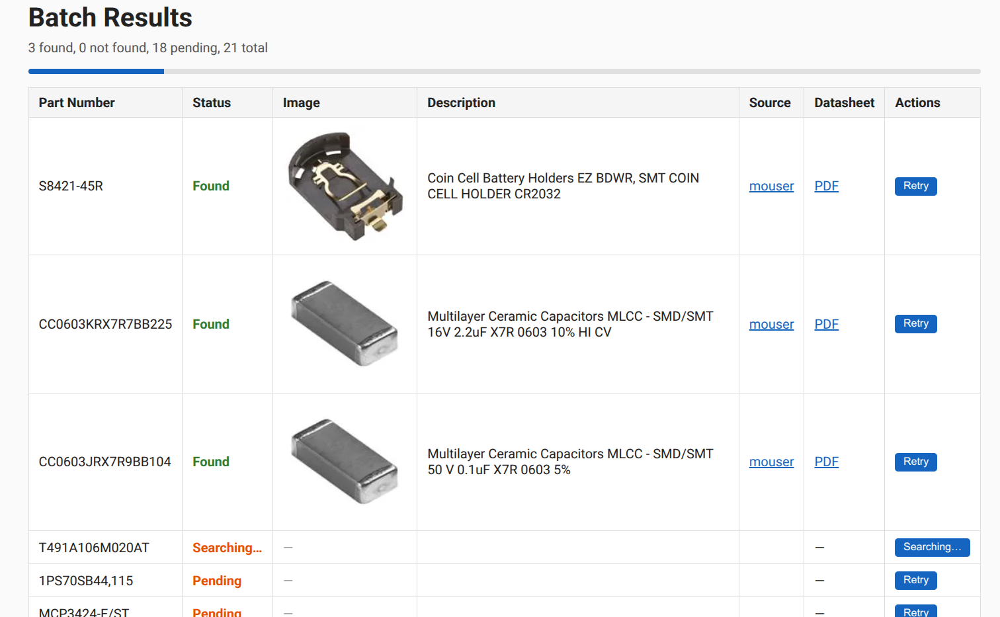

<p align="center">
  
</p>

<h1 align="center">MagpieBOM</h1>

<p align="center">
  AI-powered visual search for electronic component images and datasheets
</p>

---

MagpieBOM takes a part number, searches the web, and returns a verified product image and datasheet PDF. It uses LLM vision to confirm that the image actually shows the correct component — not a logo, banner, or wrong part.

<p align="center">
  
</p>

## Installation

```bash
git clone https://github.com/yourusername/magpiebom.git
cd magpiebom
python -m venv .venv
source .venv/bin/activate
pip install -e .
```

Playwright (used for bot-protected sites):

```bash
playwright install chromium
```

## Quick Start

Search for a single part:

```bash
magpiebom search LM7805
```

Process a batch of parts:

```bash
magpiebom batch LM7805 NE555 LM358
# or from a file
magpiebom batch parts.txt
```

Start the web UI:

```bash
magpiebom server
# opens at http://127.0.0.1:5000
```

## Configuration

Create a `.env` file:

```bash
cp .env.example .env
```

| Variable | Required | Description |
|----------|----------|-------------|
| `BRAVE_API_KEY` | Yes | [Brave Search API](https://brave.com/search/api/) key |
| `MOUSER_SEARCH_API_KEY` | No | [Mouser API](https://www.mouser.com/api-hub/) key for direct lookups |
| `DIGIKEY_CLIENT_ID` | No | DigiKey API credentials |
| `DIGIKEY_CLIENT_SECRET` | No | DigiKey API credentials |
| `LLM_BASE_URL` | No | OpenAI-compatible endpoint (default: `http://127.0.0.1:1234/v1`) |

MagpieBOM uses a local LLM with vision capabilities for image validation and description extraction. Any OpenAI-compatible API works — [LM Studio](https://lmstudio.ai/), [Ollama](https://ollama.ai/), or a cloud provider.

## How It Works

1. **API lookup** — Checks Mouser and DigiKey APIs for structured product data
2. **Web search** — Falls back to Brave Search across component distributor sites
3. **Page scraping** — Extracts images, descriptions, and datasheet links from results
4. **LLM validation** — Vision model confirms the image shows the correct individual component
5. **URL verification** — Validates all product and datasheet URLs are reachable

The pipeline prioritizes structured API data (Mouser, DigiKey) for speed and accuracy, then falls back to web search with LLM-powered verification.

## License

MIT
